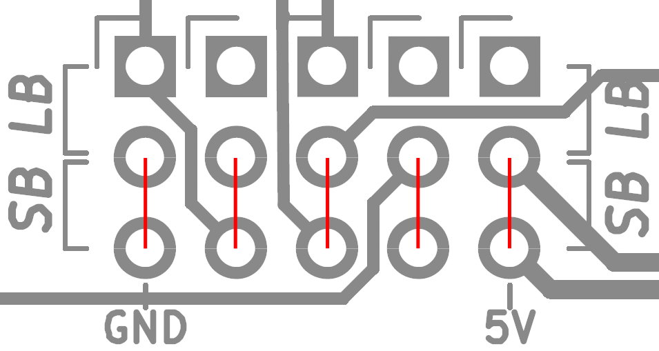

# c64-rf-modulator-replacement
C64 Composite/S-Video RF Modulator Replacement

## Quick Links
* [Schematic](pdf/c64-rf-modulator-replacement-schematic.pdf)

* [Gerber Files](gerbers)

* [PCB Renderings](images/pcb)

* [Photos](images/photos)

# Introduction 
This is my version of a C64 RF Modulator replacement based on the schematics of similar designs like [Zero-X/OMS's Modified Commodore RF Modulator Design](images/zerox-oms-modulator_simple-schematic.png) and [JMP$FCE2's S-Video only design](images/jmp$fce2-schematic.png).  This board can be used to replace a damaged or defective RF modulator in your C64, to improve the sharpness of your video output, or as a modern solution to replace the composite/luma/chroma output functionality of the original modulator on new motherboards such as the SixtyClone or Bwack’s KU-14194.

This design has a few goals that set it apart from the others:

1.	It is a universal solution that fits and is electrically compatible with both the C64 and C64C without having to change components on the board or run jumper wires for power.

2.	It is easy and inexpensive to build with only a single, small PCB and all through-hole components.

3.	It provides [high quality S-Video (Y/C) output](images/photos/video-output-6569-r5.png) while maintaining composite video output for compatibility.

4.  It provides adjustable luma/chroma output levels to fine-tune the S-video signal. This allows for the best possible compatibility with a wide variety of different board revisions, VIC chips, aging components and monitors. Adjustable levels  mean this board can also be used with s-video cables with or without an inline resistor to eliminate “checkerboarding” caused by too high of a chroma level.

# Compatibility
This RF modulator replacement is compatible with motherboard revisions 250407, 250425, 250466, and 250469, and both NTSC and PAL VIC-II chips. I have not tested it, but I believe it should also be compatible with Bwack's KU-14194 board as well since it uses the standard longboard RF modulator. It is not compatible, however, with the early revision 326298-01 boards with the 5 Pin AV Output. This revision uses a different modulator pin layout, and the video signals are not combined in the modulator. They are instead processed with discrete components inside the VIC-II can.

# Gathering the components
Kicad files are available for you to view or modify as you see fit. Gerber files are available that can be uploaded directly to your favorite PCB fab to make your own boards, and a complete Bill of Materials (BOM) can be found [here](c64-rf-modulator-replacement-bom.xlsx) with example parts from Digikey. At the time of writing this, the components cost about $12 US, not including the PCB or shipping.

I strongly recommend building the entire board, if you choose to do so, there are a few components that can be omitted in different situations to decrease the cost at the expense of features and flexibility.

## Trimmers
The trim pots used to adjust the luma and chroma are the most expensive components in this project. I highly recommend using them, but if you choose, you may jumper the solder bridges on the back of the board to bypass the trimmer pads and install 150 Ohm resistors for R4 and R7. This won't give you the precision adjustment of the trimmers, but it will be close enough for most configurations. You can experiment with different fixed value resistors between 100-1K Ohm if you want to change fixed output levels.

## No Composite Video
I have not seen any improvement in S-video quality by omitting the composite video components, but if you really don’t want composite output, L2, R8, R11, and C6 can be omitted from the build.

## No Voltage Regulator
If you are only ever going to use the RF modulator replacement on a C64C 250469 short board, you don’t need the voltage regulator or the input/output capacitors since 5V is provided directly to the modulator on pin 1. This means you can omit C3, C5, C7, C8, and U1 from the build.

# Building the board
Once you have your PCBs and all your components, soldering them together should be pretty straightforward. You can use the schematic or the BOM to place the right value parts in the right place. From a soldering standpoint, it is easiest to assemble the components starting with the lowest profile first and then work your way up. This would be mean soldering the resistors and inductor first, then the ceramic caps, the diode, electrolytic capacitors, transistors and voltage regulator, and finally, the jumper block. The jumpers can then be installed on the headers in the appropriate configuration. Finish off by removing the flux residue with some cotton swabs or a brush and isopropyl alcohol.

# Installing the board
First, you need to remove the old RF modulator. This can be a bit tricky as the large metal can will suck the heat right out of the iron. I can’t help you much here, but I can only suggest you use a soldering iron with plenty of heat, use a wide tip, to take your time, and don't rip off any traces. The new board can then be installed one of two ways.

The first is soldering it directly to the motherboard. For this, you can solder two .1” pin headers into the motherboard (making sure they are straight) and then setting the RF modulator replacement down on top of them. I recommend sticking small rubber feet near the rear of the board to help support it. You can slide two feet under the front of the rf modulator replacement to keep the pcb level and evenly spaced all the way around while you solder the headers from the top side. Trim the excess length of the header pins off and slide out the rubber feet. For a nicer finish, reflow the solder joints after you have trimmed them.

Alternatively, you can make the replacement a bit more modular by soldering two 4-pin female headers on the motherboard and two 4-pin male headers on the RF modulator replacement. This will allow you to plug and unplug the modulator easily. It is not required, but as the board will be approximately ½” above the motherboard and “hanging” on the headers, you may want to use some rubber feet, foam, or double-sided tape as a spacer to support the back of the board.

# Adjustments

## Configuring the mainboard
If you are using the longboard (Rev 250407, 250425, 240441, 250466) it is important to make sure the G.PAL/I.PAL jumper by the modulator is SHORTED, or the ground pin the modulator replacement attached to will be floating.

## Jumper Settings
The adjustment of the jumpers routes the signals to the proper pinout for the motherboard you are using, switches the correct pull-up resistor for the VIC-II luma, and enables or disables the use of an onboard 5V regulator.With all jumpers in the up position, the board is configured for use on the 12V C64 “longboards” (250407, 250425, and 250466). In this configuration, the 5V regulator is used to regulate the 9V Unregulated power on pin 1 down to 5V

With all jumpers in the down position, the board is configured for use on the 250469 “short board” commonly found in the C64C. In this configuration, the 5V input on pin 1 is fed directly in the circuit without the need for the 5V regulator. Be sure you are using a short board if all the jumpers are down, or you could accidentally fry your VIC-II by accidentally feeding it 9V unreg from a long board.

For most configurations, the jumpers should be either all up or all down; however if you understand what you are doing and want to run a 5V 856x VIC-II from a short board in a 12V long board, there is one jumper that you may want to run in a non-standard configuration. First, you MUST isolate pin 13 on the VIC-II socket from the VIC-II (the short board outputs 12V there while an 856x is expecting 5V). Pin 13 on the VIC-II can then be connected to pin 40 (which is 5V Vcc). I recommend not modifying the VIC-II chips but instead using a piggyback socket or PCB. With a standard machined pin socket, simply trim off leg 13 and solder a jumper wire from leg 13 to 40. The 856x VIC-II can then just plug into the socket without any damaging modifications. Once the VIC-II is installed, the jumpers on the RF modulator should be in the following configuration to use the correct short board 1K pullup resistor:

 	
  

## Adjusting the Output Level
If you choose to include adjustable potentiometers in your build, a counter-clockwise adjustment on the luma (Y) and chroma (C) potentiometers will reduce the output level. A clockwise adjustment will increase the output level. My recommendation is to start with both adjustments fully counter-clockwise and increase as necessary. The levels can be set with a scope or simply “by eye” depending on the tools you have available.

An ideal chroma signal should be ~300mV peak-to-peak. The adjustment on the board should allow you to adjust it from approximately ~250mV - 1.7V. This range allows you to dial back the output for use with a standard S-video cable or to turn it up to compensate for the cables with the inline 330-1K resistor. Some monitors don't care if the signal is too hot, others will give you an ugly checkered pattern (especially LCDs). If you don't have an oscilloscope to measure the peak-to-peak voltage, start with the chroma pot fully counter-clockwise and increase it until the colors are sufficiently saturated. If you go too far, the image will begin to look “grainy” or have a checkerboard pattern.

Officially, an ideal luma signal should be 1V PP (including the sync pulse). Depending on the output of the VIC-II chip you are using, the adjustment on the board should allow you to adjust it from approximately ~575mV-1.5V PP. The original breadbins output a signal around 1.2V PP, while the later C64Cs were closer to an “in-spec” 1V PP. On some monitors though 1V PP can look too look dark (requiring you to turn up the contrast on your monitor). If using a scope, I would adjust it to approximately 1.1V PP.  If adjusting by eye, start  low and increase the level until the light blue text is reasonably legible against the dark blue background. If the border and text start to look “white” you have gone too far. Another good test on a CRT is white text on a black background. If the white text is blooming, you should back the signal off. The effect will be very similar to having the contrast set too high.

Composite video output remains at a fixed output level regardless of the Y and C adjustment pots.

# Changelog
Rev A – 2020-03-15 - Prototype

Rev B – 2020-03-25 - Initial production revision, fixed schematic bugs, tweaked values and removed unnecessary components to improve picture quality

Rev C – 2020-04-05 - Adjusted positioning of several traces, vias, and regulator U1 to improve physical spacing. Changed RV1 and RV2 for "W" footprint trimmers with inline legs due to parts availability. Swapped R4 and R5 physical locations to better accomodate the new pin configuration

Rev D – 2020-04-07 - Adjusted power and ground trace thickness, added additional vias, added custom trimmer footprint to ID proper placement, optimized ground pours, increased chroma/luma/power trace isolation
